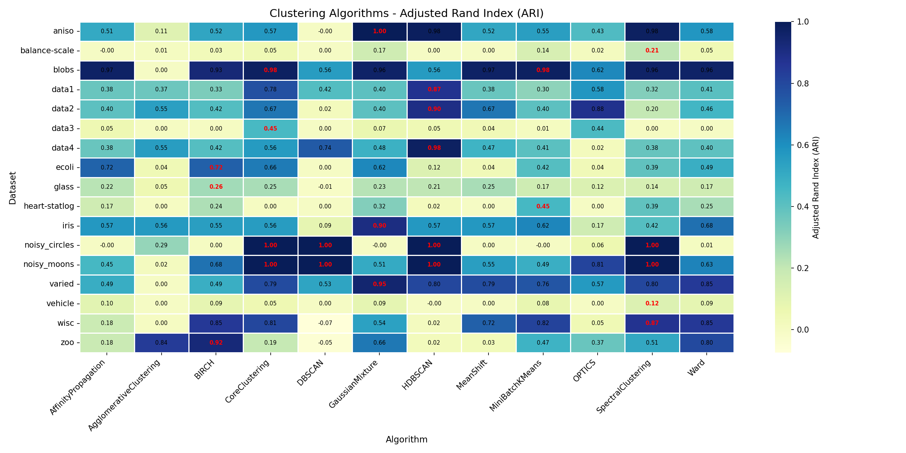
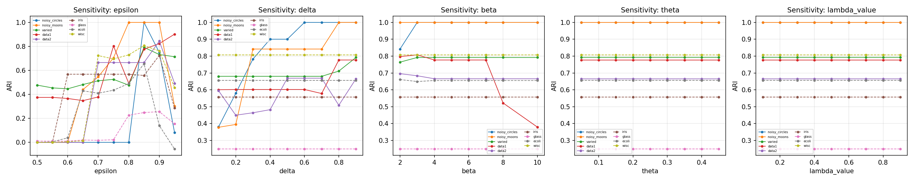
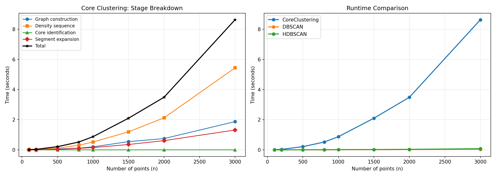
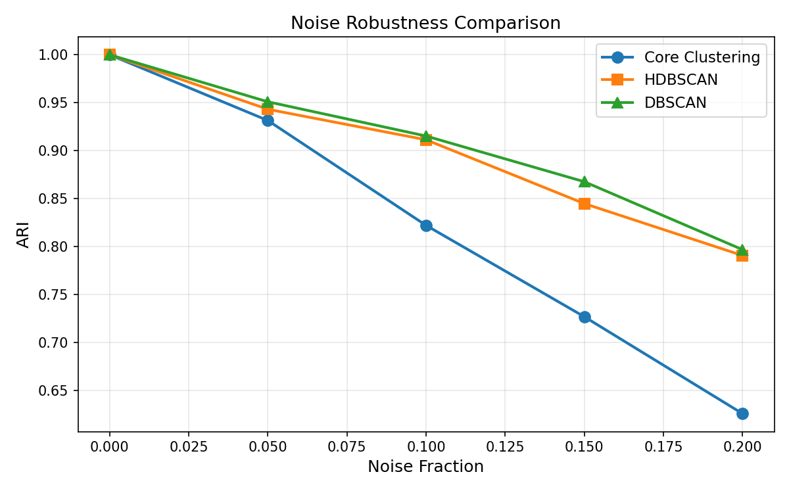
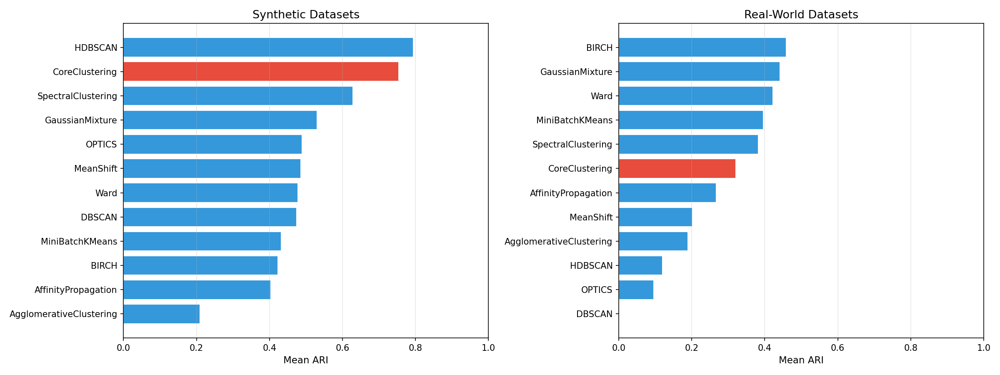

# Yadro — Graph Clustering Algorithm Based on Density Variation

[](https://www.python.org/downloads/)
[](https://opensource.org/licenses/MIT)
[](https://ijai.iaescore.com/)

A density-based graph clustering algorithm that automatically identifies core cluster regions through **density variation analysis** and iterative node removal. Unlike DBSCAN, this method does not require setting a radius parameter — instead, it discovers cluster boundaries by detecting sharp drops in a density sequence derived from the graph structure.

> **Paper:** "Graph clustering algorithm based on density variation"  
> *IAES International Journal of Artificial Intelligence (IJ-AI)*, 2025  
> Authors: Rifqat Davronov, Botir Kuziyev, Mirzo Alimov

---

## Algorithm Overview

```
Input: Dataset X = {x₁, ..., xₙ}, Parameters: ε, δ, β, θ, λ
Output: Cluster assignments {C₁, C₂, ..., Cₖ}

1. Compute pairwise Euclidean distances
2. Build weighted graph G:  wᵢⱼ = (maxᵢ - dᵢⱼ) / maxᵢ,  add edge if wᵢⱼ > ε
3. Compute local densities:  ρ(vᵢ) = Σ wᵢⱼ  for all neighbors
4. Iteratively extract min-density nodes → density variation sequences {Dₜ}, {Mₜ}
5. Compute drop rates:  Rₜ = (Dₜ - Dₜ₊₁) / Dₜ
6. Mark core nodes where β consecutive Rₜ > δ-th percentile threshold
7. Form core subgraph → connected components → initial clusters
8. Assign remaining nodes by similarity, flag low-confidence if m₂ > λ·m₁
```

**Complexity:** O(n²) time and space (dominated by graph construction).

---

## Installation

```bash
git clone https://github.com/rifqat/yadro.git
cd yadro
pip install -r requirements.txt
```

### Requirements
- Python ≥ 3.8
- numpy, scipy, networkx
- scikit-learn, pandas, matplotlib, seaborn

---

## Quick Start

```python
import numpy as np
from sklearn.datasets import make_moons
from yadro import YadroSegmentation

# Generate sample data
X, y_true = make_moons(n_samples=300, noise=0.05, random_state=42)

# Run Core Clustering
seg = YadroSegmentation(X, epsilon=0.85)
seg.full_pipeline(delta=0.9, beta=5, theta=0.1, lambda_value=0.5, visualize=False)

# Get cluster labels
print(seg.labels_)          # array([0, 1, 0, 1, ...])
print(f"Clusters found: {len(set(seg.labels_))}")
```

### Parameters

| Parameter | Default | Description |
|-----------|---------|-------------|
| `epsilon` (ε) | 0.85 | Edge weight threshold for graph construction. Range [0.80–0.90] recommended. |
| `delta` (δ) | 0.9 | Percentile threshold for density drop detection. Range [0.7–0.9] recommended. |
| `beta` (β) | 5 | Minimum consecutive steps required to mark a node as core. Range [4–6] recommended. |
| `theta` (θ) | 0.1 | Edge weight cutoff when forming core subgraph. Range [0.05–0.2]. |
| `lambda` (λ) | 0.5 | Confidence threshold for boundary assignment. Range [0.3–0.7]. |

---

## Experiments

Run all benchmark experiments (≈ 4 min):

```bash
cd experiments
python run_experiments.py
```

This executes **6 experiments** across **17 datasets** (9 synthetic + 8 real-world UCI):

| # | Experiment | Output |
|---|-----------|--------|
| 1 | Full multi-metric benchmark | `results/full_benchmark.csv`, heatmaps |
| 2 | Parameter sensitivity analysis | `results/parameter_sensitivity.csv/png` |
| 3 | Scalability benchmarks (n=100–3000) | `results/scalability.csv/png` |
| 4 | Statistical significance tests | `results/statistical_tests.csv` |
| 5 | Noise robustness analysis | `results/noise_analysis.csv/png` |
| 6 | Synthetic vs Real-world summary | `results/summary_by_type.csv/png` |

---

## Datasets

### Synthetic (9)
| Dataset | Samples | Features | Clusters |
|---------|---------|----------|----------|
| Noisy Circles | 500 | 2 | 2 |
| Noisy Moons | 500 | 2 | 2 |
| Varied Blobs | 500 | 2 | 3 |
| Anisotropic | 500 | 2 | 3 |
| Gaussian Blobs | 500 | 2 | 3 |
| data1 | 925 | 2 | 4 |
| data2 | 1,863 | 2 | 4 |
| data3 | 1,500 | 2 | 2 |
| data4 | 885 | 2 | 6 |

### Real-World UCI Benchmarks (8)
| Dataset | Samples | Features | Classes | Domain |
|---------|---------|----------|---------|--------|
| Iris | 150 | 4 | 3 | Botany |
| Glass | 214 | 9 | 6 | Forensics |
| Ecoli | 336 | 7 | 8 | Biology |
| Vehicle | 846 | 18 | 4 | Computer Vision |
| Wisconsin (WDBC) | 699 | 9 | 2 | Medical |
| Balance Scale | 625 | 4 | 3 | Decision Theory |
| Heart Statlog | 270 | 13 | 2 | Cardiology |
| Zoo | 101 | 16 | 7 | Zoology |

---

## Results

### Performance Summary

Core Clustering achieves **2nd place on synthetic datasets** (mean ARI = 0.754) and **competitive performance on real-world UCI benchmarks** (mean ARI = 0.321).

| Algorithm | Synthetic ARI | Real-World ARI |
|-----------|:---:|:---:|
| HDBSCAN | **0.794** | 0.119 |
| **CoreClustering** | **0.754** | 0.321 |
| SpectralClustering | 0.628 | 0.383 |
| BIRCH | 0.423 | **0.459** |
| GaussianMixture | 0.530 | 0.441 |
| DBSCAN | 0.475 | -0.006 |

> Density-based methods (DBSCAN, HDBSCAN, OPTICS) that excel on 2D synthetic data show severe performance degradation on higher-dimensional UCI benchmarks, while Core Clustering maintains stable behavior.

### Statistical Significance

- **Friedman test:** χ² = 35.26, **p = 0.0002** (significant differences among all methods)
- **Wilcoxon test (p < 0.05):** Core Clustering significantly outperforms **DBSCAN, OPTICS, AgglomerativeClustering, AffinityPropagation, MeanShift**

### Key Results Figures

| Figure | Description |
|--------|-------------|
|  | ARI across all 17 datasets × 12 algorithms |
|  | Parameter sensitivity analysis (5 parameters) |
|  | Runtime scaling n=100 to n=3000 |
|  | Noise robustness comparison |
|  | Synthetic vs Real-world performance |

---

## Repository Structure

```
yadro/
├── yadro/                      # Core package
│   ├── __init__.py
│   └── segmentation.py         # YadroSegmentation class
├── experiments/
│   └── run_experiments.py      # All 6 experiments
├── data/                       # Synthetic 2D datasets (data1–data4)
│   ├── data1.txt
│   ├── data2.txt
│   ├── data3.txt
│   └── data4.txt
├── real-world/                 # UCI ARFF benchmark datasets
│   ├── iris.arff
│   ├── glass.arff
│   └── ... (24 datasets total)
├── results/                    # Pre-computed experiment results
│   ├── full_benchmark.csv
│   ├── heatmap_ARI.png
│   └── ... (21 files total)
├── requirements.txt
└── README.md
```

---

## Citation

If you use this code in your research, please cite:

```bibtex
@article{davronov2025yadro,
  title   = {Graph clustering algorithm based on density variation},
  author  = {Davronov, Rifqat and Kuziyev, Botir and Alimov, Mirzo},
  journal = {IAES International Journal of Artificial Intelligence},
  year    = {2025},
  note    = {Under Review}
}
```

---

## License

MIT License — see [LICENSE](LICENSE) for details.
